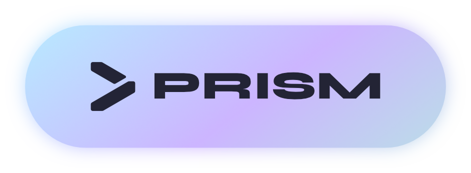
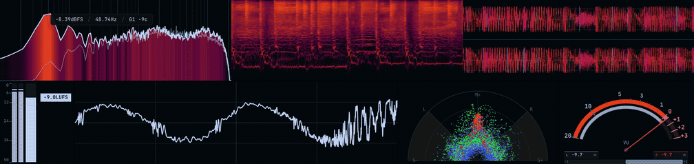
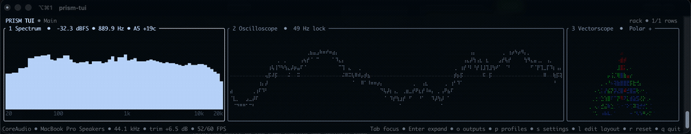

<div align="center">



**Real-time audio analysis and metering, wherever you work.**


</div>

Prism is a free, open-source audio analyzer and meter rack for Windows, macOS, and Linux.

Monitor system audio or an input with a configurable set of real-time scopes and meters, arrange them however you like, and save the setup as a profile. The same analyzers are also available as VST3/AU plugins, and Prism includes a native terminal interface for lightweight monitoring.



## Scopes

Prism includes seven scopes and meters:

* **Spectrum Analyzer** — Frequency spectrum with heatmap and fill modes, configurable FFT size, spectral tilt, multiple frequency scales, and peak information
* **Oscilloscope** — Time-domain waveform with an optional pitch-lock mode that follows the fundamental frequency
* **Vectorscope** — Stereo image and phase visualization with XY, Polar, and M/S Linear views, adjustable zoom, and an optional multiband RGB split
* **Spectrogram** — Scrolling frequency-over-time display with Log, Mel, and Linear scales and several detail modes
* **VU Meter** — Classic VU metering with needle and bar styles in horizontal or vertical layouts
* **Loudness Meter** — LUFS metering following ITU-R BS.1770 alongside stereo peak activity
* **Waveform** — Scrolling waveform view with mono, stereo, and multiband modes

Every scope can be configured independently. Resize and rearrange them into a rack, rotate them, pop individual scopes into their own windows, or pin them on top of other applications.

Compatible scopes also include an interactive measurement overlay for inspecting the display directly.

## Desktop

Prism can capture system output directly through CoreAudio on macOS, WASAPI on Windows, and PulseAudio on Linux. It can also switch to an input device when you want to analyze a microphone, interface, or line input.

No virtual audio cable is required for normal system capture.

The main rack and scope popouts can use solid, blurred, or clear backgrounds, making Prism usable as a normal desktop application or as a set of unobtrusive overlays.

Prism can also live in the system tray, start automatically with your computer, and launch either normally or out of the way when you want it running all the time.

## Rolling Capture

Prism can continuously keep the last **5, 10, 30, or 60 seconds** of audio in memory.

When you hear something you want to keep, drag the buffered audio out of Prism as a WAV file. There is no need to start recording beforehand.

## DAW Plugins

Every Prism scope is also available as a DAW plugin.

Drop a **Spectrum**, **Oscilloscope**, **Vectorscope**, **Spectrogram**, **VU Meter**, **Loudness Meter**, or **Waveform** onto a track and analyze it using the same interface and analysis engine as the desktop app.

* **VST3** on Windows, macOS, and Linux
* **AU** on macOS
* Settings are stored with your project
* Plugins follow your Prism themes and profiles
* Audio passes through untouched

Tested in Ableton Live, FL Studio, and Reaper.

The plugins install alongside Prism, so there is no separate download.

## Terminal UI

Prism also includes `prism-tui`, a native terminal interface built on the same capture and analysis code.



It provides real-time spectrum, metering, loudness, and other monitoring tools without needing to run the desktop interface.
`prism-tui` is lightweight, typically using around 35 MB of RAM.

```bash
prism-tui
prism-tui --list-outputs
prism-tui --output <id>
prism-tui --profile <name>
prism-tui --theme <name>
prism-tui --help
```

Profiles and `.iro` themes can be used from the TUI as well, and output devices can be changed without leaving it.

`prism-tui --help` lists the available controls and launch options.

## Profiles

A profile stores your Prism workspace: which scopes are visible, how they are laid out, their individual settings, and window state.

Keep different profiles for different setups or workflows and switch between them when needed.

Profiles are stored as `.prsm` files and can be shared with other Prism users.

## Themes

Prism's interface is themeable through editable `.iro` files.

Themes control the colors used throughout the application and its scopes. You can edit your own, drop them into the `Prism Themes` folder, or download themes made by the community.


Prism also includes chroma-key-friendly themes for using scopes as overlays in OBS or other video software.


## Download

Prebuilt versions of Prism for Windows, macOS, and Linux are available on the [Releases](https://github.com/Boof2015/prism/releases) page.

Installable packages include the desktop application and the components supported by that package, including DAW plugins and `prism-tui` where applicable.

On Windows, the NSIS installer adds `prism-tui` to the machine `PATH`. Open a new terminal after installation so it inherits the updated environment. The portable Windows package does not modify `PATH`.

## Building from Source

**Prerequisites:** Node.js 18+, npm, CMake 3.22+, and a C++ compiler toolchain.

| Platform | Toolchain                                                                                               |
| -------- | ------------------------------------------------------------------------------------------------------- |
| macOS    | Xcode Command Line Tools                                                                                |
| Windows  | Visual Studio Build Tools                                                                               |
| Linux    | `build-essential`, `python3`, `libasound2-dev`, `libpulse-dev`, `libgtk-3-dev`, `libwebkit2gtk-4.1-dev` |

```bash
git clone https://github.com/Boof2015/prism.git
cd prism
npm install
```

The `postinstall` script compiles the native C++ module for your platform.

```bash
npm run dev              # Development
npm run build            # Build application assets
npm run configure:tui    # Configure the standalone CMake project
npm run build:tui        # Build prism-tui
npm run test:tui         # Build and run native TUI tests
npm run dist             # Package for current platform
npm run dist:mac         # macOS
npm run dist:win         # Windows
npm run dist:linux       # Linux
```

The TUI build downloads the pinned FTXUI source through CMake. Linux also requires the PulseAudio development package.

The DAW plugins build with CMake from the [`plugin/`](plugin/) directory. See [`plugin/README.md`](plugin/README.md) for per-platform build and installation details.

## Astra Integration

Prism can optionally connect to [Astra](https://github.com/Boof2015/astra) through its local API to show currently playing music, cover art, track information, and playback controls alongside your scopes.

Prism does not require Astra and works as a standalone application.

## Support

If you find Prism useful and want to support a broke college student, consider supporting development:

[](https://ko-fi.com/boof2015)

## License

Prism is licensed under the [GNU General Public License v3.0](https://www.gnu.org/licenses/gpl-3.0.html). See [LICENSE](LICENSE) for the full text.

Third-party license notices are recorded in [THIRD_PARTY_NOTICES.md](THIRD_PARTY_NOTICES.md).
