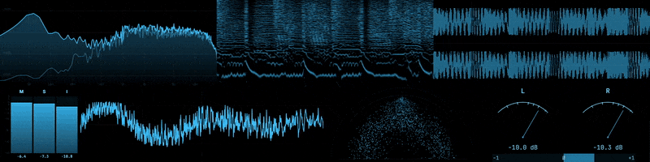
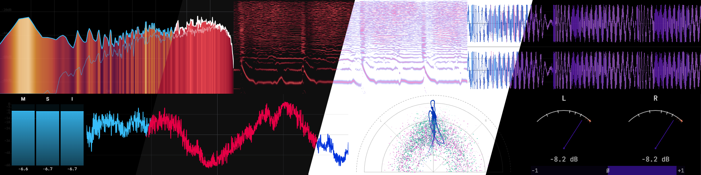
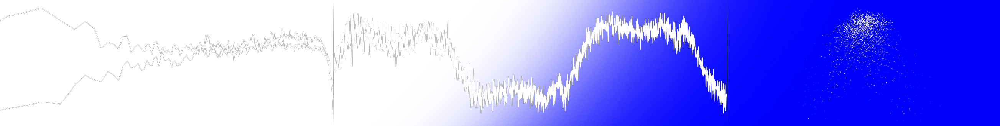

# Prism

A free, open-source audio visualizer and meter rack for your desktop.


Prism taps into your system audio and runs it through a rack of real-time scopes and meters. It grew out of the visualization engine in [Astra](https://github.com/Boof2015/astra), rebuilt as a standalone tool. Whether you're mixing a track, tuning a room, or just like watching your music, Prism gives you a window into what you're hearing.

## Scopes

Seven visualizers driven by a native C++ analysis engine:

- **Spectrum Analyzer** — FFT frequency display with heatmap and fill modes, configurable FFT size, spectral tilt, and log or linear scaling
- **Oscilloscope** — Time-domain waveform with a pitch-lock mode that syncs the display to the fundamental frequency
- **Vectorscope** — Stereo phase visualization in five display modes (Lissajous, polar, linear) with optional multiband RGB split
- **Spectrogram** — Scrolling frequency-over-time display with mel, log, and linear scale modes
- **VU Meter** — Classic loudness metering in needle or bar style, horizontal or vertical
- **LUFS Meter** — Integrated loudness metering following ITU-R BS.1770
- **Waveform** — Scrolling time-domain view with mono, stereo, and multiband modes



Every scope is independently configurable. Drag and resize them into whatever layout makes sense, pop any scope out into its own window, and pin windows on top so they stay visible while you work.

## Audio Capture

Prism pulls audio at the OS level, straight from CoreAudio on macOS, WASAPI on Windows, or PulseAudio on Linux. No virtual cables or routing hacks. Flip on device input mode when you want to analyze a mic or a line-in instead. 

Capture-to-display latency measures under 8ms. When tested at 120fps, measured latency was 0ms. What you see is what you hear.

## Profiles

Save the whole rack as a profile. What's visible, how it's laid out, per-scope settings, popout window positions as a `.prsm` file. Keep separate profiles for different workflows and share them with others.

## Themes

The whole interface is themeable through editable `.iro` files. Themes control everything, build your own in an editor and drop it into the `Prism Themes` folder, or download one from [the community](https://discord.gg/hsKK8Kr9Nj).




Prism also includes Chroma key friendly themes by default, so you can key out your scopes in OBS and drop them directly into your stream as transparent overlays.



## Download

Prebuilt binaries for Windows, macOS, and Linux are available on the [Releases](https://github.com/Boof2015/prism/releases) page.

## Building from Source

**Prerequisites:** Node.js 18+, npm, and a C++ compiler toolchain.

| Platform | Toolchain |
|----------|-----------|
| macOS | Xcode Command Line Tools |
| Windows | Visual Studio Build Tools |
| Linux | `build-essential`, `python3`, `libasound2-dev`, `libpulse-dev` |

```bash
git clone https://github.com/Boof2015/prism.git
cd prism
npm install
```

The `postinstall` script compiles the native C++ module for your platform.

```bash
npm run dev              # Development
npm run build            # Build application assets
npm run dist             # Package for current platform
npm run dist:mac         # macOS (DMG + ZIP)
npm run dist:win         # Windows (NSIS + Portable)
npm run dist:linux       # Linux (AppImage + DEB)
```

## Astra Integration

If you use [Astra](https://github.com/Boof2015/astra), Prism can connect to its local API to show what's playing, cover art, track info, and playback controls,  alongside your scopes.

## Support

If you find Prism useful and want to support a broke college student, consider supporting development:

[](https://ko-fi.com/boof2015)

## License

This project is licensed under the [GNU General Public License v3.0](https://www.gnu.org/licenses/gpl-3.0.html). See [LICENSE](LICENSE) for the full text.

## Star History

<a href="https://www.star-history.com/#Boof2015/prism&type=date&legend=top-left">
 <picture>
   <source media="(prefers-color-scheme: dark)" srcset="https://api.star-history.com/svg?repos=Boof2015/prism&type=date&theme=dark&legend=top-left" />
   <source media="(prefers-color-scheme: light)" srcset="https://api.star-history.com/svg?repos=Boof2015/prism&type=date&legend=top-left" />
   
 </picture>
</a>
