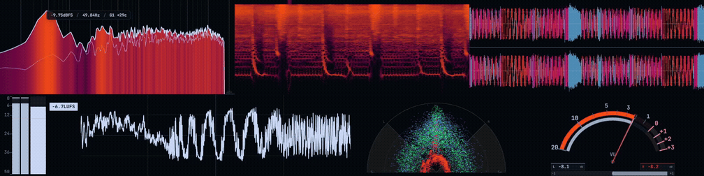

<div align="center">


**Real-time audio analysis and metering, wherever you work.**


</div>

Prism is a free, open-source audio analyzer and meter rack for Windows, macOS, and Linux.

Monitor system audio or an input with a configurable set of real-time scopes and meters, arrange them however you like, and save the setup as a profile. The same analyzers are also available as VST3/AU plugins, and Prism includes a native terminal interface for lightweight monitoring.


## Scopes

Prism includes seven real-time scopes and meters:

* **Spectrum Analyzer** — FFT spectrum with calibrated dBFS levels, configurable FFT size, spectral tilt, Log/Mel/Linear scales, heatmap and fill modes, and peak/pitch readouts
* **Oscilloscope** — Time-domain waveform with fundamental-frequency pitch locking and sub-sample triggering for a stable display
* **Vectorscope** — Full-band stereo phase analysis with XY, Polar, and M/S Linear views, calibrated references, adjustable zoom, and optional multiband RGB
* **Spectrogram** — Scrolling frequency-over-time display with Log/Mel/Linear scales, stereo-energy analysis, and frequency reassignment in Sharp and Sharper modes
* **VU Meter** — 300 ms metering with adjustable 0 VU reference, stereo correlation, and needle or bar displays
* **Loudness Meter** — ITU-R BS.1770 momentary, short-term, and integrated LUFS metering with BS.1770 true-peak activity
* **Waveform** — Scrolling mono or stereo waveform with transient-preserving min/max sampling and optional multiband energy visualization

Every scope can be configured independently. Resize and rearrange them into a rack, rotate supported scopes, pop them into separate windows, or pin them on top of other applications.



Spectrum, Spectrogram, Oscilloscope, and Waveform also include interactive measurement overlays for inspecting frequency, level, pitch, amplitude, or time directly from the display. Optional Linked Analysis mirrors compatible frequency, history-time, and amplitude guides across docked and detached scopes.

<details> <summary><strong>Stats for nerds</strong></summary>

Most of Prism's analysis runs in native C++, with the same DSP implementations reused across the desktop app, DAW plugins, and terminal interface where applicable.

### Spectrum

* Hann-windowed FFT with selectable sizes from 1024 to 16384 samples
* Coherent-gain correction for calibrated dBFS magnitude rather than arbitrary FFT amplitude
* Native calibration tests measure bin-centered tones within ±0.05 dB and off-bin interpolated peaks within 0.3 dB across all exposed FFT sizes
* Maintains Mid, Side, Left, Right, and channel-max spectra internally
* Logarithmic, Slaney Mel, and Linear frequency scales
* Extended 10 Hz–24 kHz and Audible 20 Hz–20 kHz ranges, automatically clamped to Nyquist
* Independent spectral and heatmap tilt around a 1 kHz reference
* Peak analysis can report dBFS, frequency, musical note, octave, and cents offset
* Interactive measurement overlay exposes frequency, level, and pitch directly from the graph

### Spectrogram

* Hann-windowed FFT with 4× zero-padding
* Coherent amplitude normalization for calibrated spectral levels
* Native tests keep tone levels within 0.3 dB across multiple FFT sizes, amplitudes, and off-bin frequencies
* Logarithmic, Slaney Mel, and Linear frequency mapping
* Frequency placement is tested across 44.1, 48, and 96 kHz sample rates
* Classic mode provides a conventional spectral display
* Focused mode relocates local spectral peaks using phase correction and a local spectral centroid
* Sharp and Sharper perform phase-based frequency reassignment rather than post-process image sharpening
* Reassignment operates on every visible contributing FFT bin instead of only local maxima, preserving quieter partials and ambience
* Reassigned power compensates for Hann-window equivalent noise bandwidth and zero-padding so relocation remains level-calibrated
* Stereo analysis combines L/R energy rather than summing to mono, so anti-phase material remains visible instead of cancelling out
* Native tests verify reassigned tones stay on the correct Log, Mel, and Linear frequency rows
* Interactive inspection reports frequency, pitch, and time history

### Oscilloscope

* FFT-based fundamental detection over a 2048-sample analysis window
* Pitch detector currently searches from 40 to 1000 Hz
* Pitch-lock dynamically retunes a narrow FIR band-pass around the detected fundamental
* Triggering follows a rising zero crossing rather than simply drawing the newest block of samples
* Trigger positions retain sub-sample precision
* Catmull-Rom interpolation is used when reading the waveform at fractional sample positions
* Adaptive pitch smoothing locks quickly at startup and becomes more conservative once stable
* Interactive measurement reports time, linear amplitude, and dBFS

### Vectorscope

* Full-band L/R analysis with no hidden high-frequency low-pass
* Native regression tests explicitly verify preservation of content above 8 kHz at 44.1, 48, and 96 kHz
* XY mode uses the original channel samples directly: Right on X, Left on Y
* XY and M/S Linear modes use calibrated channel-amplitude reference boundaries
* Polar retains an intentionally amplitude-compressed radial projection so low-level stereo structure remains readable
* Folded modes rotate negative-Mid samples rather than discarding them
* Adjustable display zoom from −12 to +24 dB without modifying the underlying signal
* Optional three-band stereo view with 250 Hz and 2.5 kHz crossovers
* Multiband analysis retains separate low, mid, and high L/R signals

### Loudness

* ITU-R BS.1770-style K-weighting using the pre-filter and RLB weighting stages
* Momentary loudness uses a 400 ms window
* Short-term loudness uses a 3 second window
* Integrated loudness uses overlapping 400 ms blocks with 100 ms hops
* −70 LUFS absolute gate
* Relative gate at −10 LU below ungated programme loudness
* Momentary, short-term, and integrated LUFS are calculated independently
* Stereo true-peak reconstruction uses a rate-aware 48-tap-per-phase FIR at 2× to 8× oversampling for common 44.1–192 kHz host rates
* Held L/R true-peak markers and a reset-scoped combined maximum are reported in dBTP

### VU and correlation

* 300 ms RMS integration window
* Adjustable 0 VU calibration from −30 to 0 dBFS
* Default reference is 0 VU = −14 dBFS
* Stereo correlation is calculated over the same analysis window and reported from −1 to +1
* 750 ms sample-peak hold
* Peak decay of 18 dB/s
* Bar envelope uses a 5 ms attack and 180 ms release
* Needle and bar displays can use the same underlying analysis

### Waveform

* Each rendered time column retains the minimum and maximum sample instead of selecting or averaging a single sample, helping preserve short transients while downsampling the history
* Mono and separate stereo-lane modes
* Optional multiband view calculates low, mid, and high RMS energy for every displayed time column
* Uses the same 250 Hz and 2.5 kHz multiband split as the vectorscope
* Interactive measurement reports time history, amplitude, and dBFS

### Capture

* Native CoreAudio system-output capture on macOS using Audio Hardware Taps
* Native WASAPI loopback capture on Windows
* Native PulseAudio monitor-source capture on Linux
* Linux capture handles U8, 16-bit, 24-bit, 32-bit integer, and 32-bit floating-point PulseAudio formats before normalizing them for analysis
* Microphone and interface inputs use a separate low-latency AudioWorklet capture path
* Capture follows the active device sample rate instead of assuming a fixed 44.1 or 48 kHz analysis rate

### Rolling capture

* Keeps the previous 5, 10, 30, or 60 seconds of audio available without starting a recording beforehand
* Buffer is stored as PCM and exported as a standard RIFF/WAV file
* Mono and stereo capture are supported
* Exported clips use 16-bit PCM
* The export path supports source sample rates up to 384 kHz
* Captured audio can be dragged directly out of Prism as a file

### DAW plugins

* All seven Prism analyzers are built from the same native DSP source used by the desktop application
* VST3 on Windows, macOS, and Linux
* AU on macOS
* Mono and stereo host layouts are supported
* Analyzer plugins are pure pass-through: Prism does not modify the host's audio buffer
* The realtime process callback only copies samples into a FIFO
* FFT, loudness, visualization, and other analysis work happens outside the realtime audio thread
* Scope configuration is serialized into the DAW's project/plugin state
* Plugins use JUCE 8 and a shared Prism web UI while keeping analysis native

### Terminal UI

* Native C++ frontend using the same Spectrum, Oscilloscope, Vectorscope, VU, Loudness, Spectrogram, Waveform, and system-capture implementations
* 60 FPS default rendering
* Experimental 120 FPS mode
* Compatibility mode uses 256-color output at up to 60 FPS
* Safe mode uses basic ANSI colors and caps rendering at 30 FPS
* Supports live output-device switching
* Supports input trim before every analyzer
* Includes pitch locking, vectorscope modes, calibrated VU reference levels, spectrogram reassignment modes, mono/stereo waveform views, and multiband analysis
* Reads Prism .iro themes and has its own shareable profile/customization system
* Typically uses around 35 MB of RAM

### Rendering and measurement

* Desktop visualizers can target 10, 30, 60, 120, or 144 FPS, or synchronize to the display refresh rate
* Spectrum, Spectrogram, Oscilloscope, and Waveform support interactive measurement overlays
* Measurement coordinates account for scope rotation and mirroring, so displayed readouts continue to correspond to the underlying signal after transforming a scope
* Linked Analysis maps only compatible semantic axes between scopes and hides guides when an exact value is outside the target's visible range

</details>


## Desktop

Prism can capture system output directly through CoreAudio on macOS, WASAPI on Windows, and PulseAudio on Linux. It can also switch to an input device when you want to analyze a microphone, interface, or line input.

No virtual audio cable is required for normal system capture.

The main rack and scope popouts can use solid, blurred, or clear backgrounds, making Prism usable as a normal desktop application or as a set of unobtrusive overlays.

Prism can also live in the system tray, start automatically with your computer, and launch either normally or out of the way when you want it running all the time.

## Rolling Capture

Prism can continuously keep the last **5, 10, 30, or 60 seconds** of audio in memory.

When you hear something you want to keep, drag the buffered audio out of Prism as a WAV file. There is no need to start recording beforehand.

## DAW Plugins

Every Prism scope is also available as a DAW plugin.

Drop a **Spectrum**, **Oscilloscope**, **Vectorscope**, **Spectrogram**, **VU Meter**, **Loudness Meter**, or **Waveform** onto a track and analyze it using the same interface and analysis engine as the desktop app.

* **VST3** on Windows, macOS, and Linux
* **AU** on macOS
* Settings are stored with your project
* Plugins follow your Prism themes and profiles
* Audio passes through untouched

Tested in Ableton Live, FL Studio, and Reaper.

The plugins install alongside Prism, so there is no separate download.

## Terminal UI

Prism also includes `prism-tui`, a native terminal interface built on the same capture and analysis code.


It provides real-time spectrum, metering, loudness, and other monitoring tools without needing to run the desktop interface.
`prism-tui` is lightweight, typically using around 35 MB of RAM.

```bash
prism-tui
prism-tui --list-outputs
prism-tui --output <id>
prism-tui --profile <name>
prism-tui --theme <name>
prism-tui --help
```

Profiles and `.iro` themes can be used from the TUI as well, and output devices can be changed without leaving it.

`prism-tui --help` lists the available controls and launch options.

## Profiles

A profile stores your Prism workspace: which scopes are visible, how they are laid out, their individual settings, and window state.

Keep different profiles for different setups or workflows and switch between them when needed.

Profiles are stored as `.prsm` files and can be shared with other Prism users.

## Themes

Prism's interface is themeable through editable `.iro` files.

Themes control the colors used throughout the application and its scopes. You can edit your own, drop them into the `Prism Themes` folder, or download themes made by the community.


Prism also includes chroma-key-friendly themes for using scopes as overlays in OBS or other video software.


## Download

Prebuilt versions of Prism for Windows, macOS, and Linux are available on the [Releases](https://github.com/Boof2015/prism/releases) page.

Installable packages include the desktop application and the components supported by that package, including DAW plugins and `prism-tui` where applicable.

On Windows, the NSIS installer adds `prism-tui` to the machine `PATH`. Open a new terminal after installation so it inherits the updated environment. The portable Windows package does not modify `PATH`.

## Building from Source

**Prerequisites:** Node.js 18+, npm, CMake 3.22+, and a C++ compiler toolchain.

| Platform | Toolchain                                                                                               |
| -------- | ------------------------------------------------------------------------------------------------------- |
| macOS    | Xcode Command Line Tools                                                                                |
| Windows  | Visual Studio Build Tools                                                                               |
| Linux    | `build-essential`, `python3`, `libasound2-dev`, `libpulse-dev`, `libgtk-3-dev`, `libwebkit2gtk-4.1-dev` |

```bash
git clone https://github.com/Boof2015/prism.git
cd prism
npm install
```

The `postinstall` script compiles the native C++ module for your platform.

```bash
npm run dev              # Development
npm run build            # Build application assets
npm run configure:tui    # Configure the standalone CMake project
npm run build:tui        # Build prism-tui
npm run test:tui         # Build and run native TUI tests
npm run test:lufsmeter-native # Run generated BS.1770/EBU true-peak vectors
npm run dist             # Package for current platform
npm run dist:mac         # macOS
npm run dist:win         # Windows
npm run dist:linux       # Linux
```

If you have downloaded and extracted the official [EBU Loudness Test Set](https://tech.ebu.ch/publications/ebu_loudness_test_set) for internal testing, run cases 15–23 without copying the WAVs into the repository. The files are not downloaded or redistributed by Prism, in accordance with the [EBU test-sequence usage terms](https://tech.ebu.ch/files/live/sites/tech/files/shared/testmaterial/use%20of%20EBU%20AUDIO%20test%20sequences.pdf).

```bash
npm run test:lufsmeter-ebu -- /path/to/extracted-ebu-loudness-test-set
```

The TUI build downloads the pinned FTXUI source through CMake. Linux also requires the PulseAudio development package.

The DAW plugins build with CMake from the [`plugin/`](plugin/) directory. See [`plugin/README.md`](plugin/README.md) for per-platform build and installation details.

## Astra Integration

Prism can optionally connect to [Astra](https://github.com/Boof2015/astra) through its local API to show currently playing music, cover art, track information, and playback controls alongside your scopes.

Prism does not require Astra and works as a standalone application.

## Support

If you find Prism useful and want to support a broke college student, consider supporting development:

[](https://ko-fi.com/boof2015)

## License

Prism is licensed under the [GNU General Public License v3.0](https://www.gnu.org/licenses/gpl-3.0.html). See [LICENSE](LICENSE) for the full text.

Third-party license notices are recorded in [THIRD_PARTY_NOTICES.md](THIRD_PARTY_NOTICES.md).
